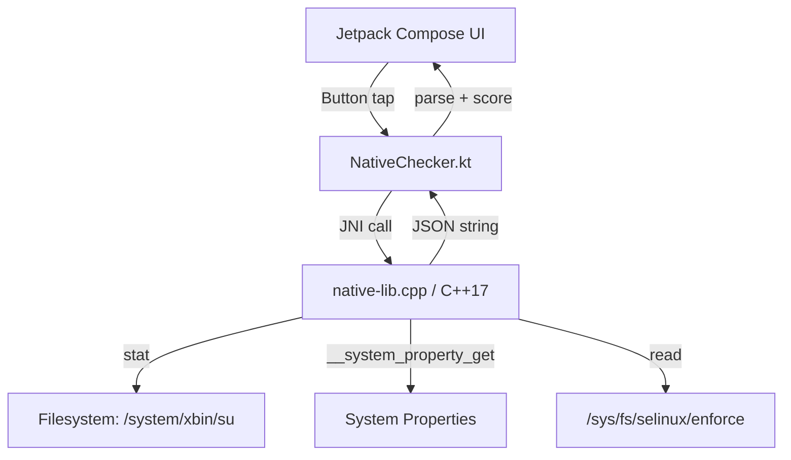

# Root Integrity Detector

> A native Android security demo that detects root/tamper indicators via C++17 + JNI and visualizes an integrity score with Jetpack Compose.


## How It Works

```
Jetpack Compose UI
        │
        ▼
NativeChecker.kt  ──(JNI)──▶  native-lib.cpp (C++17)
                                      │
                          ┌───────────┼───────────┐
                          ▼           ▼            ▼
                     stat() call   __system_    /sys/fs/
                     (su binary)  property_get  selinux/
                                  (build props) enforce
                                      │
                                      ▼
                               JSON result string
                                      │
                                      ▼
                         Score computed in Kotlin
```

1. The UI triggers a check via `NativeChecker.nativeCheck()`
2. JNI calls into `native-lib.cpp`, which runs all checks using Android system APIs
3. Results are returned as a JSON string and parsed in `MainActivity.kt`
4. The integrity score is computed from the parsed results and displayed

---

## Security Checks

| Check | What It Detects | Score Penalty |
|-------|----------------|---------------|
| Su binary | `/system/xbin/su` file presence | −70 |
| Build tags | `ro.build.tags` contains `test-keys` | −15 |
| Debuggable flag | `ro.debuggable == 1` | −10 |
| Secure flag | `ro.secure == 0` | −10 |
| SELinux enforcement | `/sys/fs/selinux/enforce == 0` | −10 |

Score is clamped to the range `[0, 100]`.

---

## Architecture



**Module layout:**

```
app/src/main/
├── java/com/abdulmuhg/rootintegritydetector/
│   ├── MainActivity.kt        # Compose UI + score logic
│   └── NativeChecker.kt       # JNI bridge (loads native library)
└── cpp/
    ├── CMakeLists.txt          # CMake config, C++17, -O2
    └── native-lib.cpp          # All security checks
```

---

## Getting Started

### Prerequisites

- [Android Studio Ladybug](https://developer.android.com/studio) or newer
- NDK r27+ (install via **SDK Manager → SDK Tools → NDK**)
- CMake 3.22+ (install via **SDK Manager → SDK Tools → CMake**)

### Build & Run

```bash
git clone https://github.com/abdulmuhg/RootIntegrityDetector.git
cd RootIntegrityDetector
```

1. Open the project in Android Studio
2. Let Gradle sync complete
3. Connect a device or start an emulator (API 24+)
4. Click **Run** or press `Shift+F10`
5. Tap **Run Integrity Check** in the app

> For best results, test on both a stock (non-rooted) device and a rooted/emulator device to see the score difference.

---

## Roadmap

- [ ] Additional root detection checks (Magisk paths, `/proc/mounts` scan, build fingerprint)
- [ ] Unit tests for the native layer using Google Test / CTest
- [ ] CI/CD via GitHub Actions (build + lint on every PR)
- [ ] ProGuard/R8 configuration for release builds

---

## Contributing

Contributions are welcome! See [CONTRIBUTING.md](CONTRIBUTING.md) for guidelines on reporting bugs, suggesting features, and submitting pull requests.

---

## License

This project is licensed under the [MIT License](LICENSE).
